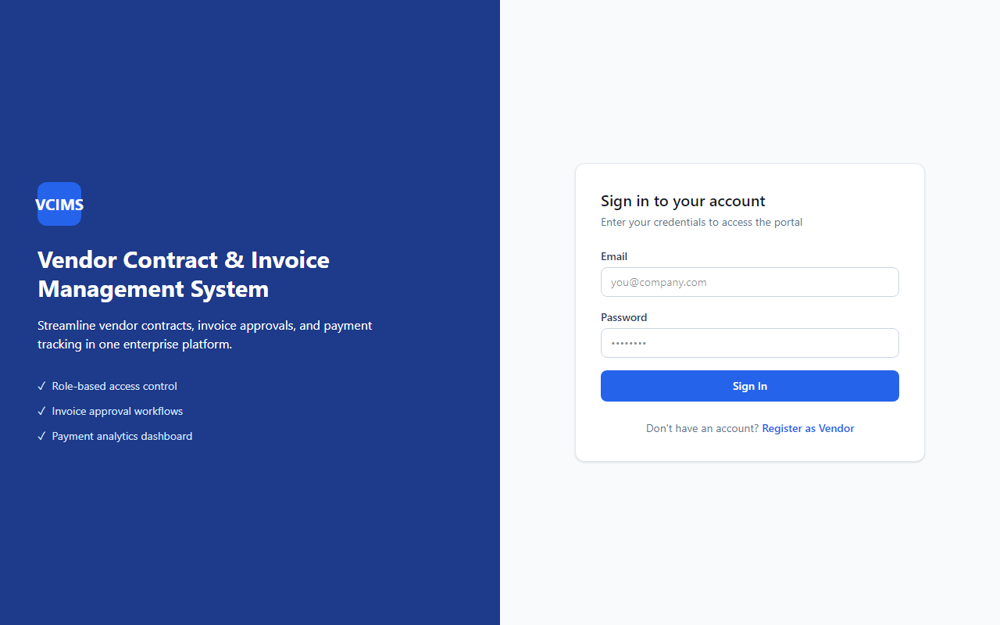
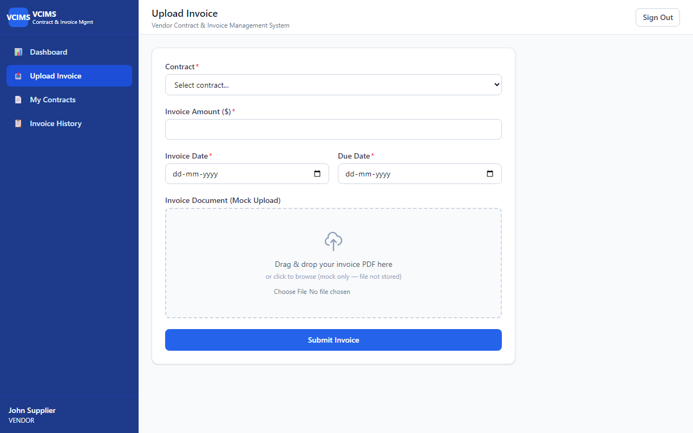
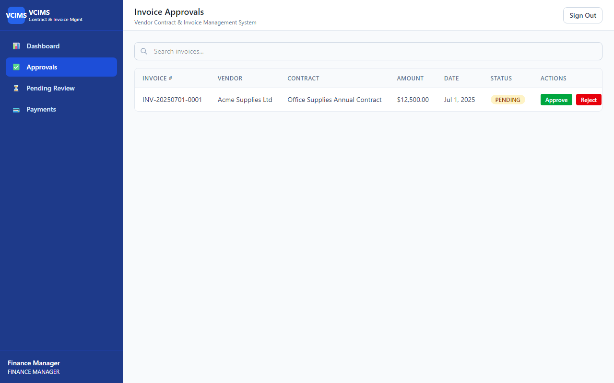
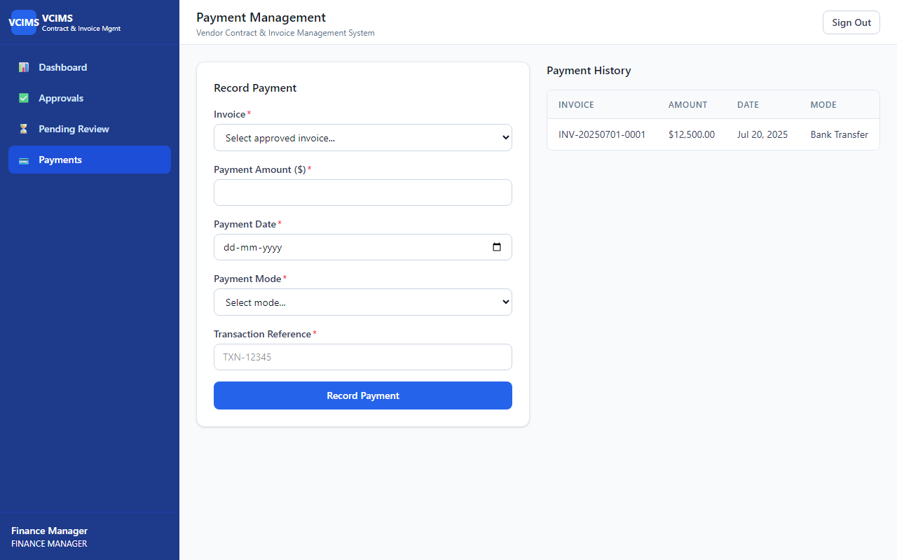
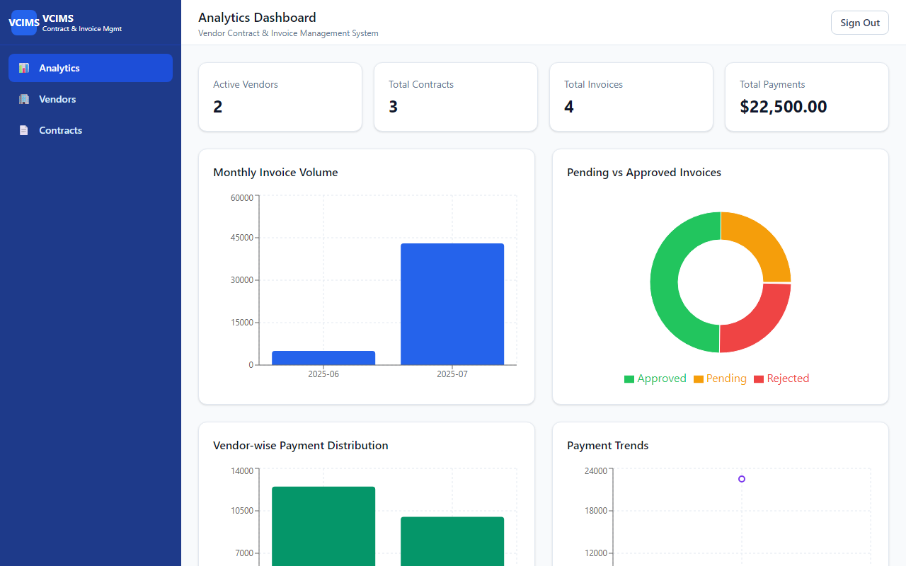
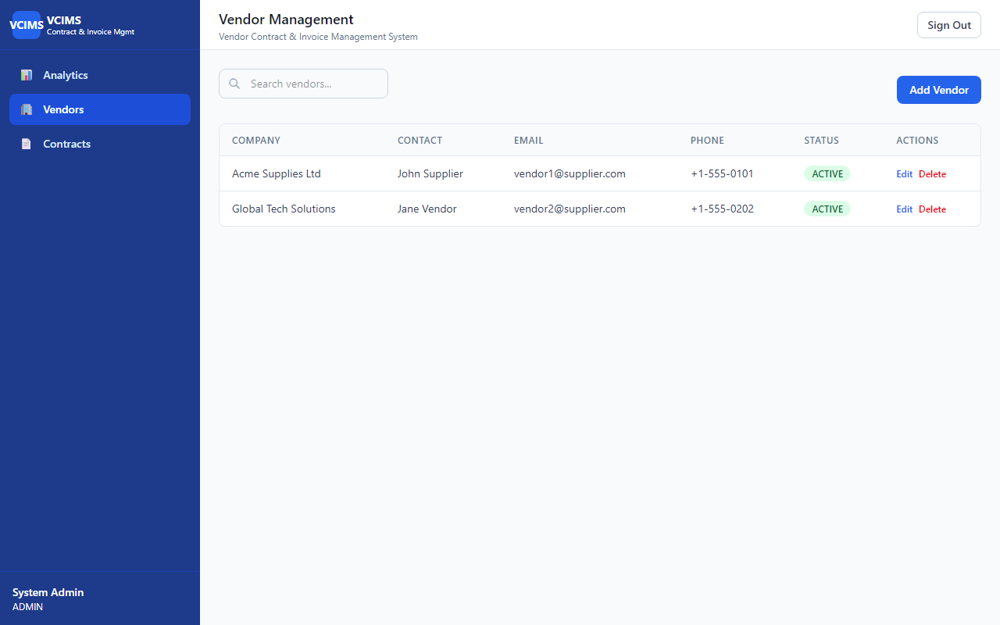

# Vendor Contract & Invoice Management System

Enterprise-grade full stack application for vendor contract management, invoice processing, approval workflows, and payment analytics.

## Tech Stack

| Layer | Technology |
|-------|------------|
| Frontend | React (Vite), Tailwind CSS, React Router, Recharts |
| Backend | Node.js, Express, Sequelize ORM |
| Database | MySQL 8 |
| Auth | JWT (JSON Web Tokens) |

## Prerequisites

- Node.js 18+
- MySQL 8+
- npm

## Project Structure

```
task-13/
├── backend/
│   ├── controllers/     # Request handlers
│   ├── models/          # Sequelize models
│   ├── routes/          # API routes
│   ├── middlewares/     # Auth, role guards, error handling
│   ├── services/        # Business logic
│   ├── utils/           # Helpers (JWT, pagination)
│   ├── seeders/         # Database seed script
│   └── server.js
├── frontend/
│   └── src/
│       ├── pages/       # Role-based pages
│       ├── components/  # Reusable UI components
│       ├── context/     # Auth context
│       ├── services/    # API client
│       └── charts/      # Recharts analytics
├── database/
│   └── schema.sql
├── screenshots/         # Application screenshots
└── README.md
```

## Database Setup

1. Start MySQL and create the database:

```bash
mysql -u root -p < database/schema.sql
```

2. Configure backend environment:

```bash
cd backend
cp .env.example .env
# Edit .env with your MySQL credentials
```

3. Seed test data:

```bash
cd backend
npm install
npm run seed
```

## Running the Application

**Backend** (port 5000):

```bash
cd backend
npm install
npm run dev
```

**Frontend** (port 5173):

```bash
cd frontend
npm install
npm run dev
```

Open [http://localhost:5173](http://localhost:5173)

## Test Credentials

| Role | Email | Password |
|------|-------|----------|
| Admin | admin@company.com | password123 |
| Finance Manager | finance@company.com | password123 |
| Vendor 1 | vendor1@supplier.com | password123 |
| Vendor 2 | vendor2@supplier.com | password123 |

## User Roles & Features

### Vendor
- Upload invoices (with mock file upload UI)
- View assigned contracts
- Track invoice approval and payment status

### Finance Manager
- Review and approve/reject invoices
- Record payments for approved invoices
- Monitor pending approvals and payment history

### Admin
- Manage vendors and contracts (CRUD)
- View analytics dashboard with charts

## API Endpoints

### Authentication
| Method | Endpoint | Description |
|--------|----------|-------------|
| POST | `/api/register` | Register new user |
| POST | `/api/login` | Login and receive JWT |
| GET | `/api/profile` | Get current user profile |

### Vendors
| Method | Endpoint | Access |
|--------|----------|--------|
| GET/POST | `/api/vendors` | Admin (write), Finance (read) |
| PUT/DELETE | `/api/vendors/:id` | Admin |

### Contracts
| Method | Endpoint | Access |
|--------|----------|--------|
| GET/POST | `/api/contracts` | Admin (write), Finance/Vendor (read) |
| PUT/DELETE | `/api/contracts/:id` | Admin |

### Invoices
| Method | Endpoint | Access |
|--------|----------|--------|
| GET | `/api/invoices` | All roles (vendor scoped) |
| POST | `/api/invoices` | Vendor |
| PUT | `/api/invoices/:id/approve` | Finance Manager |
| PUT | `/api/invoices/:id/reject` | Finance Manager |

### Payments
| Method | Endpoint | Access |
|--------|----------|--------|
| GET | `/api/payments` | All roles |
| POST | `/api/payments` | Finance Manager |

### Dashboards
| Method | Endpoint | Access |
|--------|----------|--------|
| GET | `/api/dashboard/admin` | Admin |
| GET | `/api/dashboard/finance` | Finance Manager |
| GET | `/api/dashboard/vendor` | Vendor |

## Write-Up Questions

### 1. Relationship between vendors, contracts, invoices, and payments

Vendors are the core business entities that hold contracts. Each contract belongs to one vendor and defines the terms (value, dates, status). Invoices are submitted against a specific contract and vendor, representing billing requests. Payments are recorded against approved invoices to settle amounts. Invoice comments provide an audit trail for approval decisions.

### 2. Invoice approval workflow

Invoices are created with `approval_status = PENDING`. Finance Managers use dedicated endpoints (`PUT /api/invoices/:id/approve` and `PUT /api/invoices/:id/reject`) to transition status to `APPROVED` or `REJECTED`. Rejections can include comments stored in `invoice_comments`. Only pending invoices can be approved or rejected.

### 3. Preventing unauthorized invoice approval

The approve/reject routes are protected by JWT authentication and a `roleGuard('FINANCE_MANAGER')` middleware. Users with Admin or Vendor roles receive HTTP 403 Forbidden. Additionally, vendors can only access their own invoices via vendor_id scoping in the service layer.

### 4. Validations before marking an invoice as paid

- Invoice must have `approval_status = APPROVED`
- Payment amount must be greater than zero
- Cumulative payments cannot exceed the invoice amount
- Payment status is auto-derived: `UNPAID` → `PARTIALLY_PAID` → `PAID` based on total payments vs invoice amount

### 5. Scaling optimization priority

The **invoice list/query module** should be optimized first. It handles the highest read volume across all roles with search, filter, and pagination. Recommended optimizations: database indexes on `approval_status`, `payment_status`, `vendor_id`, and `invoice_date` (already in schema); ensure all list endpoints paginate; consider caching dashboard aggregations or using read replicas for analytics queries.

## Screenshots

### Login


### Invoice Upload (Vendor)


### Invoice Approval Flow (Finance)


### Payment Dashboard (Finance)


### Analytics Dashboard (Admin)


### Vendor Management (Admin)


## Demo Video Script

1. **Vendor flow:** Login as vendor → Upload invoice → View invoice history
2. **Finance flow:** Login as finance → Approve pending invoice → Record payment
3. **Admin flow:** Login as admin → Manage vendor → View analytics dashboard
